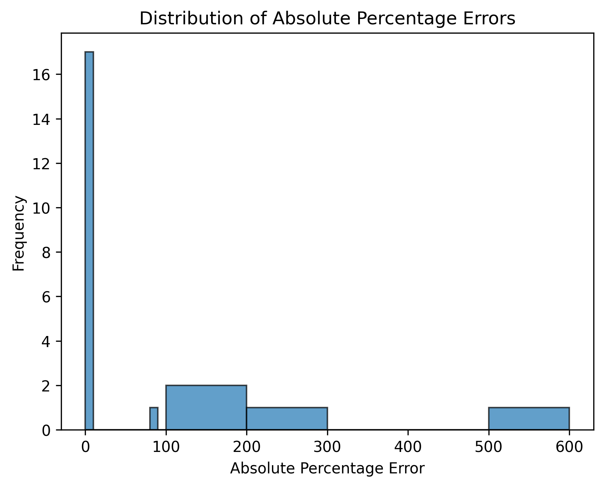

# Tomoro AI Take-home Assignment (ConvFinQA) 

## Running the Model

Before attempting to run the model, save your API key to a `.env` file in the root and update `agent.py` with your desired model choice, in the format given here: https://ai.pydantic.dev/models/

To run the model, use `uv run main.py`. 

This will run the model on three datapoints, print the results, and save the outputs to `qa_results.json`.

To get the accuracy metrics, use `uv run eval.py`. 

This will update the histogram and print both accuracy metrics I explored.

## Data Exploration

In my exploration of the data, I noticed that the data itself has some imperfections. Firstly, there are rows where the "table" doesn't make sense. For example, the first datapoint in the JSON has it's columns given as: 
`["2008",`
`"year ended june 30 2009 2008",`
`"year ended june 30 2009 2008",`
`"year ended june 30 2009"],`
a clear mistake. Given more time, I would do a deeper dive into how we might go about cleaning up these imperfections, or at the very least flagging bad datapoints.

There are a small number of questions where the expected answers are non-numerical. Since these are a small minority of data points, for the purposes of this task I will skip them. 

## Accuracy Metrics

The answers in the dataset are all numeric. I initially chose to use the absolute percentage error as my accuracy metric, calculated as:
$  APE = \left|\frac{\text{actual} - \text{expected}}{\text{expected}}\right| \times 100\% 

I chose this for a few reasons. Firstly, the dataset's "answer" values represent financial metrics like revenue, profit margins, and growth rates. Financial data can vary greatly in magnitude (from small percentages to billions in revenue). Percentage error normalizes these differences, making errors comparable across different scales.

Secondly, I thought it important to consider the use-case of such a model. The nature of the dataset means this model will most likely be used in business cases, where I believe the absolute percentage error's interpretability would be better than other metrics for numerical errors (RMSE etc.). We can easily make a statement like "the prediction was off by X%" and can reasonably assume this would be understood by non-technical stakeholders.

Finally, in financial calculations we can assume that both over and under-predictions are equally as problematic for model performance, so we need some form of symmetry. The absolute value ensures this is the case.

__My value for mean absolute percentage error for the data I have run the model on so far is 51.3%.__

One potential drawback of the absolute percentage error is that the final mean value is skewed by the cases where the LLM's answer is wildly off the correct answer. Upon analysing the distribution of percentage errors, this proved to be the case (see below).

There is a clear division between percentage errors < 10 and those > 80 in this histogram. If we make the assumption that errors within 10% are rounding errors (an assumption that would have to be tested further), a potential alternative accuracy metric would be to set a 10% threshold for the percentage error and then calculate a score based on the proportion of datapoints that are below that error margin. 

__My threshold-based error rate for the data I have run the model on so far is 0.77.__

This metric feels much more representative of the true accuracy of my model.

Another possible option would have been to do an exact match on the numbers. Since we are dealing with financial data, it is important that the model gets the answer exactly correct. However, the dataset answers are not well formatted. They have inconsistencies in the number of decimal places/significant figures that they display. Again with more time it might have been possible to pre-process the dataset further, however some of the precision of the answers would have been compromised to account for rounding. As such, the percentage error metric seemed optimal.

## Evaluation

Due to constraints with free tier API keys, I set up a way to work with API rate limits whilst also having an expansive set of LLM outputs and associated evaluations. I select a random subset of three datapoints in the data and run it, appending the answers and metadata to qa_results.json. For the size of the dataset, repeating the same datapoints is unlikely, however the non-deterministic nature of LLMs means even repeated data points are not invalid, since they can be considered separate prompts to our LLM.

## Further Development Options

In my output I include the datapoints used. Given more time, I would try to do some validation of these against the question, and potentially also against the table to make sure they are being extracted properly.

Given more time I would also add robust testing to the LLM. I would implement a PyTest framework that tests each Agent tool is called for some prompt.

As mentioned above, this project could also be extended to allow for processing and validation against the small number of non-numerical answers in the dataset.

Due to time and API constraints, I was only able to test Gemini 2.0 Flash, but the setup allows for easy experimentation with different models.